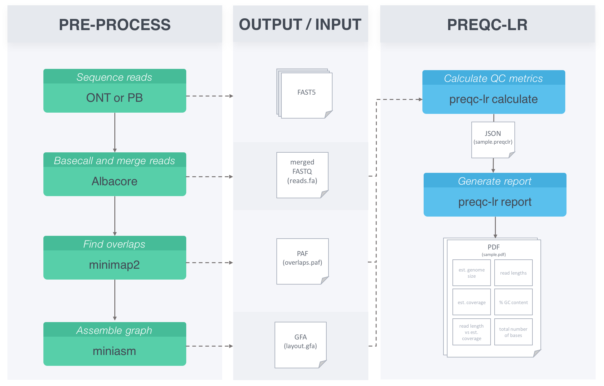

.. _introduction:

What is preqc-lr?
====================================
With the emergence of new long read sequencing technology such as Pacbio Single Molecule, Real-Time (SMRT) Sequencing technology and Oxford Nanopore Technologies (ONT), there is a need for a method that assesses sequencing quality prior to analyses. Prior to genome assembly, preqc-lr can be used to infer quality statistics without alignment to a reference genome.

There are two components to preqc-lr:

    1. Calculate
    2. Report

Calculate
----------------
The first tool will calculate all the datasets needed to create plots using overlap inform
ation provided by minimap2.

Report
----------------
The second tool reads the calculated output and generates a pdf with the following plots:
    1. Estimated genome size
    2. Read length distribution
    3. Estimated coverage distribution
    4. Per read GC content distribution
    5. Estimated coverage vs read length 
    6. Total number of bases as a function of minimum read length
    7. NG(X)

