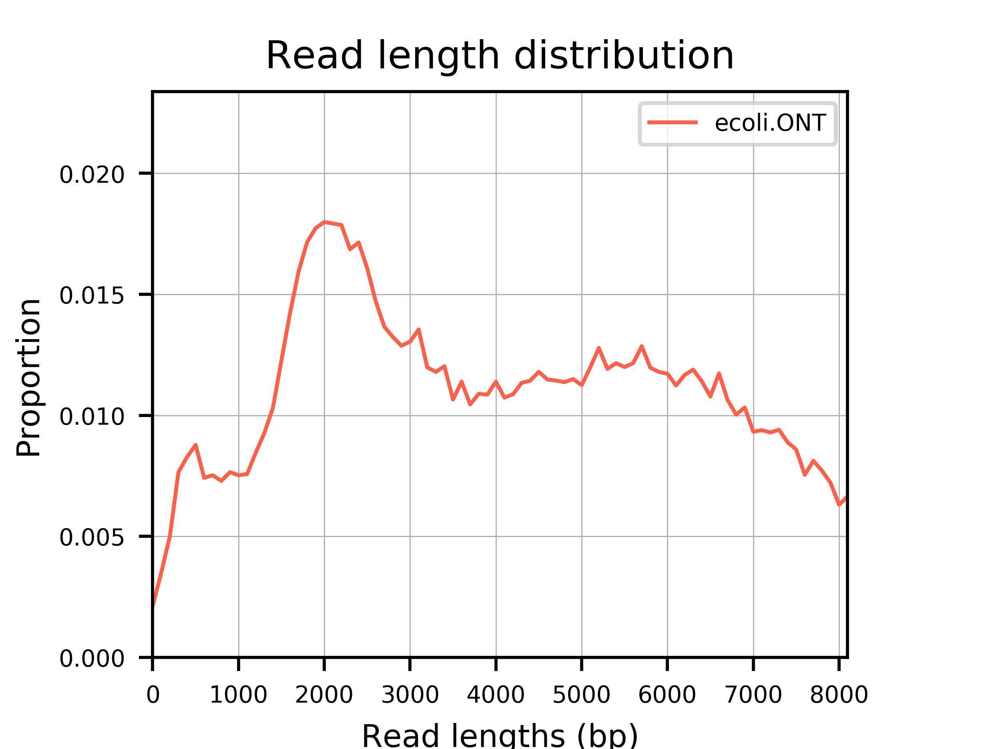
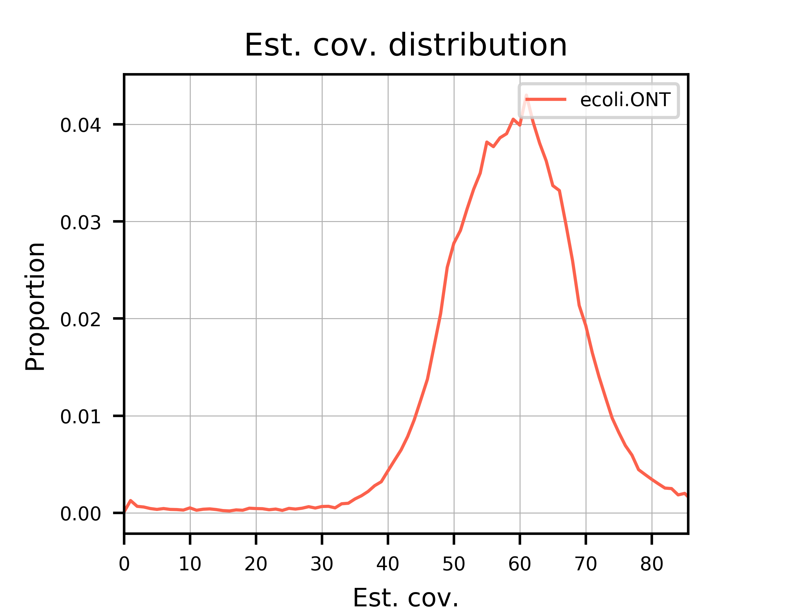
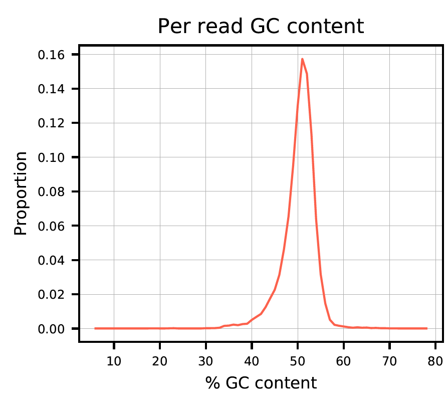
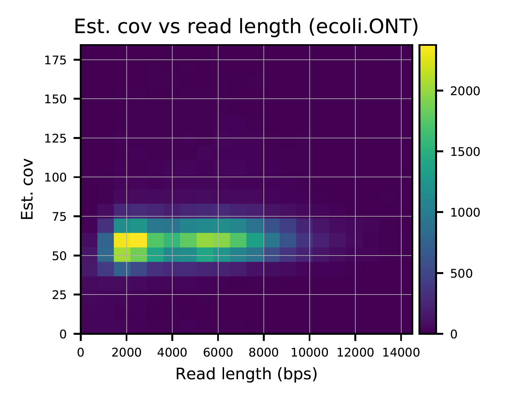
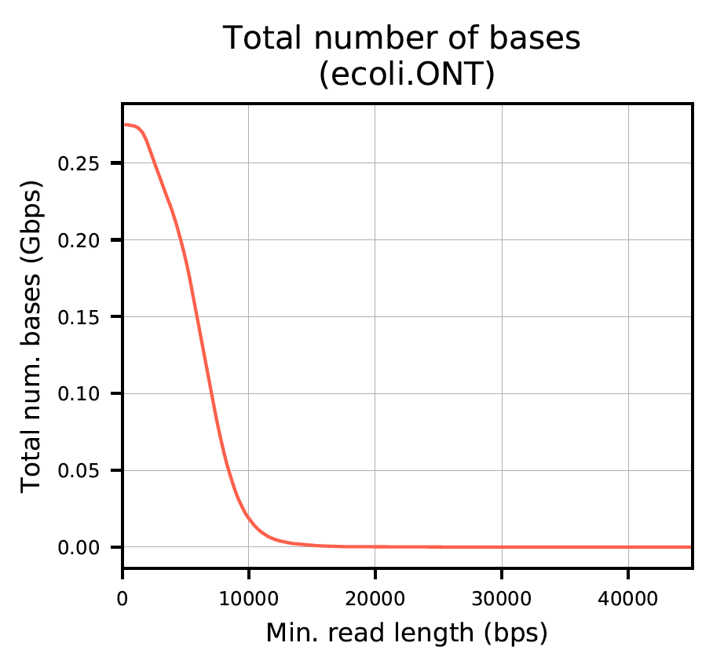
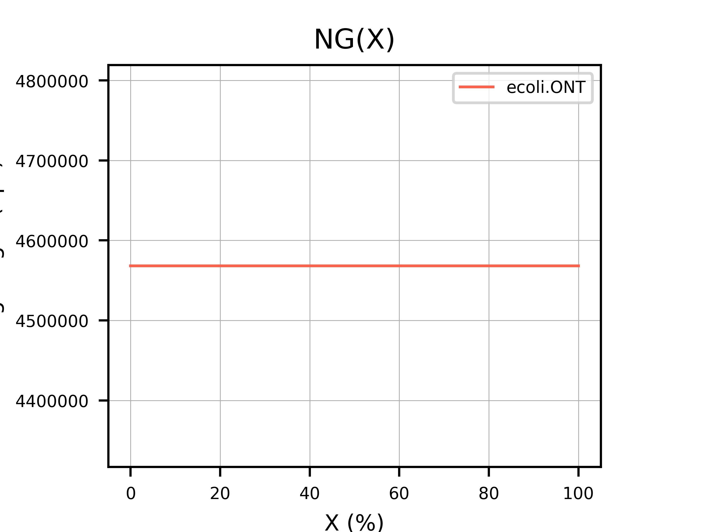

.. _quickstart:

Quickstart
============

**Time:** 10 minutes 

preqc-lr generates a PDF report containing several plots such as estimated genome size and coverage. This report can be used to evaluate the quality of your sequencing data. Here, we provide a step-by-step tutorial to get you started!

**Requirements:**

* `preqc-lr v2.0 <https://github.com/simpsonlab/preqc-lr>`_ 
* `minimap2 v2.6 <https://github.com/lh3/minimap2>`_
* `miniasm v0.2 <https://github.com/lh3/miniasm/>`_

Download example dataset
""""""""""""""""""""""""""

You can download the example dataset we will use here: ::

    wget http://s3.climb.ac.uk/nanopolish_tutorial/preqclr_example_data.tar.gz
    tar -xf preqclr_example_data.tar.gz
    cd example_data/

**Details:**

This dataset from an *E. coli* sample were produced using Oxford Nanopore Technologies (ONT) MinION sequencer.

* Sample :		E. coli str. K-12 substr. MG1655
* Instrument : 	ONT MinION sequencing R9.4 chemistry
* Basecaller :	Albacore v2.0.1
* Number of reads: 63931

Generate overlap information with minimap2
""""""""""""""""""""""""""""""""""""""""""""""""

We use minimap2 to find overlaps between our ONT long reads: ::

   minimap2 -x ava-ont albacore_v2.0.1-merged.fasta albacore_v2.0.1-merged.fasta > overlaps.paf 

If we take a peek at the first few lines of the Pairwise mApping Format (PAF) file, we see the following: ::

     7fd051aa-c88b-4cf7-8846-cc2117780be2_Basecall_1D_template	6605	118	6425	-	ae8fc44b-ee05-4c7a-a611-483bb408cb9e_Basecall_1D_template	7834	629	7230	24806671	0	tp:A:S	cm:i:387	s1:i:2413	dv:f:0.1144
     7fd051aa-c88b-4cf7-8846-cc2117780be2_Basecall_1D_template	6605	343	6417	-	cecc6ee9-f1ec-4c82-915a-5312f39f7ec5_Basecall_1D_template	6762	421	6710	24286372	0	tp:A:S	cm:i:370	s1:i:2374	dv:f:0.1149
     7fd051aa-c88b-4cf7-8846-cc2117780be2_Basecall_1D_template	6605	118	6377	-	c0d8087f-ad9f-430c-8094-24c6187bed6c_Basecall_1D_template	11415	3039	9493	22646559	0	tp:A:S	cm:i:346	s1:i:2209	dv:f:0.1214
     7fd051aa-c88b-4cf7-8846-cc2117780be2_Basecall_1D_template	6605	738	6422	-	bbb93738-16ec-4bcd-86e5-31e852946a7d_Basecall_1D_template	6596	553	6498	20916000	0	tp:A:S	cm:i:302	s1:i:2031	dv:f:0.1242
     7fd051aa-c88b-4cf7-8846-cc2117780be2_Basecall_1D_template	6605	212	6422	-	943b8d89-2ee5-4d67-91d1-a94772afed31_Basecall_1D_template	7324	807	7152	20676448	0	tp:A:S	cm:i:322	s1:i:2011	dv:f:0.1255

You can find more information about the format of the PAF file `here <https://github.com/lh3/miniasm/blob/master/PAF.md>`_.

Generate assembly graph with miniasm
"""""""""""""""""""""""""""""""""""""""""""""""""

We use miniasm to get an assembly graph in the `Graphical Fragment Assembly <https://github.com/GFA-spec/GFA-spec/blob/master/GFA-spec.md>`_ format: ::

   miniasm -f albacore_v2.0.1-merged.fasta overlaps.paf > layout.gfa

.. note:: Make sure ``layout.gfa`` and ``overlaps.paf`` are not empty before continuing.

Perform calculations
""""""""""""""""""""""""

We now have the necessary files to run preqc-lr (``albacore_v2.0.1-merged.fasta``, ``overlaps.paf``, and ``layout.gfa``). 
To generate the data needed for the report we first run preqc-lr-calculate ::

    ./preqclr \
        --reads albacore_v2.0.1-merged.fasta \
        --sample_name ecoli.ONT \
        --paf overlaps.paf \
        --gfa layout.gfa \
        --verbose

This will produce a JSON formatted file (``ecoli.ONT.preqclr``) and a log of calculations that were performed (``ecoli.ONT_preqclr-calculate.log``).

Generate report
"""""""""""""""""""

Now we are ready to run preqclr-report to generate a PDF file describing quality metrics of the sequencing data: ::

    python preqclr-report.py \
        -i ecoli.ONT.preqclr --verbose

This will produce a PDF file: ``ecoli.ONT.pdf``.

Example report
"""""""""""""""""""

The report produces plots as seen below.

**Plot 0:**

.. figure:: _static/plot_est_genome_size.png
  :scale: 60%
  :alt: plot_est_genome_size

**Plot 1:**

**Plot 2:**

**Plot 3:**

**Plot 4:**

**Plot 5:**

**Plot 6:**

